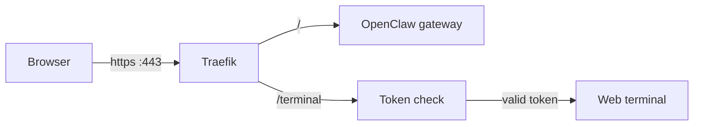
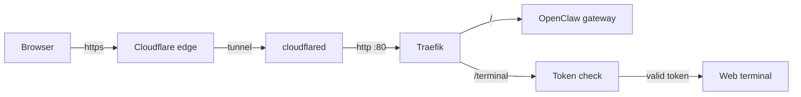

# OpenClaw Host Kit

Self-host [OpenClaw](https://openclaw.ai) on your own machine and give each of your friends their own private instance with a unique URL. Got a spare PC, a cheap VPS, or a beefy server sitting around? This turns it into a mini hosting platform.

Each person gets:
- Their own OpenClaw dashboard at `https://openclaw-alice.yourhost.example.com/`
- A password-protected web terminal at `https://openclaw-alice.yourhost.example.com/terminal?token=...`
- Isolated resources (CPU, memory, storage) so one person can't hog everything

> **Just want a hosted instance without any setup?**
>
> **[Get OpenClaw Managed Hosting](https://www.agent37.com/openclaw)** — $3.99/mo, cancel anytime. 2 vCPU, 4 GB RAM, SSL included. No config, no waiting. Spin one up in seconds and skip everything below.

---

## Try It Locally (1 Command)

No server needed. Just [Docker](https://docs.docker.com/get-docker/) running on your machine.

This runs on your laptop using [localtest.me](http://readme.localtest.me/) (a wildcard domain that points to `127.0.0.1`) with a self-signed HTTPS certificate.

```bash
git clone https://github.com/Agent-3-7/openclaw-host-kit
cd openclaw-host-kit
./scripts/local-up.sh 2
```

That's it. You'll get 2 instances with URLs like:

```
https://openclaw-demo1.localtest.me:18090/          # dashboard
https://openclaw-demo1.localtest.me:18090/terminal?token=abc...   # web terminal

https://openclaw-demo2.localtest.me:18090/
https://openclaw-demo2.localtest.me:18090/terminal?token=def...
```

> **First visit:** Your browser will show a "Your connection is not private" warning because the certificate is self-signed. Click **Advanced > Proceed** (Chrome) or **Accept the Risk** (Firefox). This is expected for local development — the real server deploy uses proper SSL.

> **Tip:** If your browser doesn't resolve `localtest.me`, use curl with an explicit Host header:
> ```bash
> curl -k -H "Host: openclaw-demo1.localtest.me" "https://localhost:18090/"
> ```

To stop everything:
```bash
./scripts/local-down.sh
```

---

## Deploy on a Server (Share with Friends)

This is the real setup. You run one server, and each friend gets their own subdomain with HTTPS.

There are two ways to get traffic to your server. Pick whichever fits your situation:

| | **Option A: Direct with Traefik** | **Option B: Cloudflare Tunnel** |
|---|---|---|
| **Best for** | VPS / cloud VM with a public IP | Home servers, machines behind NAT, no static IP |
| **Open ports** | Port 443 must be open | None — traffic flows through Cloudflare's network |
| **TLS certificates** | Let's Encrypt via Traefik (DNS-01 challenge) | Handled by Cloudflare automatically |
| **DNS provider** | Vercel | Cloudflare (free) |

### How many friends?

Rule of thumb: **each instance needs ~4 GB RAM**.

| Your server | Instances you can host |
|---|---|
| 8 GB RAM | ~2 |
| 16 GB RAM | ~4 |
| 32 GB RAM | ~8 |
| 64 GB RAM | ~16 |

---

### Option A: Direct Server with Traefik

Traditional setup: your server has a public IP, Traefik handles TLS with Let's Encrypt certificates.

#### What you need

1. A Linux VM (Ubuntu/Debian) with port **443** open (Docker is installed automatically)
2. A domain with **DNS managed by [Vercel](https://vercel.com/docs/projects/domains)** (e.g. `example.com`)
3. A **wildcard DNS A record** pointing to your server:
   ```
   *.h1.openclaw.example.com  ->  <your server IP>
   ```
4. A **[Vercel API token](https://vercel.com/account/tokens)** — Traefik uses this to automatically prove you own the domain and get wildcard SSL certificates (via DNS-01 challenge). This is why your DNS needs to be on Vercel.

#### Setup

```bash
git clone https://github.com/Agent-3-7/openclaw-host-kit
cd openclaw-host-kit
cp .env.example .env
```

Edit `.env` with your values:
```bash
OPENCLAW_BASE_DOMAIN=example.com
OPENCLAW_HOST_SHARD=h1
OPENCLAW_ACME_EMAIL=you@example.com
OPENCLAW_VERCEL_API_TOKEN=your_vercel_token
OPENCLAW_TTYD_SECRET=some_long_random_string
```

Provision the server (installs Docker, starts Traefik reverse proxy):
```bash
sudo ./scripts/provision-host.sh
```

---

### Option B: Cloudflare Tunnel

No public IP or open ports needed. Cloudflare handles TLS and routes traffic through an encrypted tunnel to your machine.

#### What you need

1. A Linux machine (Ubuntu/Debian) — Docker is installed automatically
2. A domain with **DNS on [Cloudflare](https://dash.cloudflare.com/)** (free plan works)
3. A Cloudflare account with access to [Zero Trust](https://one.dash.cloudflare.com/)

#### 1. Create a Cloudflare Tunnel

1. Go to [Zero Trust](https://one.dash.cloudflare.com/) → **Networks** → **Tunnels**
2. Click **Create a tunnel** → choose **Cloudflared** as the connector
3. Give it a name (e.g. `openclaw-h1`)
4. On the Install Connector page, copy the **tunnel token** (the long string after `--token`). You don't need to install the connector on your machine — the Docker setup handles that.
5. Click **Next** to skip to the Public Hostname tab, but don't add a hostname yet — we'll do that after provisioning

Note the **Tunnel ID** shown on the tunnel overview page (a UUID like `abcd1234-...`).

#### 2. Get your Zone ID and API token

**Zone ID:**
- Go to the [Cloudflare dashboard](https://dash.cloudflare.com/) → select your domain
- The **Zone ID** is on the right sidebar of the Overview page

**API Token:**
- Go to **My Profile** → [**API Tokens**](https://dash.cloudflare.com/profile/api-tokens) → **Create Token**
- Use the **Edit zone DNS** template
- Scope it to your specific domain under **Zone Resources**
- Create the token and copy it

#### 3. Configure and provision

```bash
git clone https://github.com/Agent-3-7/openclaw-host-kit
cd openclaw-host-kit
cp .env.example .env
```

Edit `.env`:
```bash
OPENCLAW_BASE_DOMAIN=example.com
OPENCLAW_HOST_SHARD=h1
OPENCLAW_TTYD_SECRET=some_long_random_string

OPENCLAW_DEPLOY_MODE=cloudflare-tunnel
OPENCLAW_CLOUDFLARE_TUNNEL_TOKEN=eyJhIjoiYWJj...   # from step 1
OPENCLAW_CLOUDFLARE_API_TOKEN=your_api_token        # from step 2
OPENCLAW_CLOUDFLARE_ZONE_ID=your_zone_id            # from step 2
OPENCLAW_CLOUDFLARE_TUNNEL_ID=abcd1234-...          # from step 1
```

Provision the server (installs Docker, starts Traefik + cloudflared):
```bash
sudo ./scripts/provision-host.sh
```

#### 4. Set up DNS and tunnel routing

Create the wildcard DNS record (CNAME pointing to your tunnel):
```bash
./scripts/cf-dns-create-wildcard.sh
```

Then add the public hostname in Cloudflare:
1. Go to [Zero Trust](https://one.dash.cloudflare.com/) → **Networks** → **Tunnels** → click your tunnel → **Edit**
2. Go to the **Public Hostname** tab → **Add a public hostname**
3. Fill in:
   - **Subdomain:** `*.h1.openclaw` (adjust to match your shard and subdomain)
   - **Domain:** `example.com` (your base domain)
   - **Type:** HTTP
   - **URL:** `traefik:80`
4. Save

#### 5. Create instances

From here it's the same as Option A — [jump to creating instances](#create-instances-for-your-friends).

---

### Create instances for your friends

Pick any ID you like — a name, a random string, whatever:
```bash
sudo ./scripts/create-instance.sh alice
sudo ./scripts/create-instance.sh bob
sudo ./scripts/create-instance.sh charlie
```

Get the URLs to send them:
```bash
./scripts/terminal-url.sh alice
# https://openclaw-alice.h1.openclaw.example.com/terminal?token=...

sudo ./scripts/dashboard-url.sh alice
# https://openclaw-alice.h1.openclaw.example.com/overview?token=...
```

Send your friend their terminal URL. They open it in a browser and get a full web terminal. The dashboard URL gives them the OpenClaw control panel.

---

## How It Works

**Direct (Traefik) mode:**



**Cloudflare Tunnel mode:**



- **Traefik** sits at the front, handles routing each subdomain to the right container (and TLS in direct mode)
- **cloudflared** (tunnel mode only) connects to Cloudflare's edge and forwards traffic to Traefik over the local Docker network
- **Each instance** is a Docker container running the OpenClaw gateway + a web terminal ([ttyd](https://github.com/tsl0922/ttyd))
- **Terminal auth** uses HMAC tokens with a 24-hour TTL — random people can't get a shell even if they guess the hostname
- **Each container** gets its own CPU, memory, and PID limits so one instance can't take down the server
- **Data persists** at `/var/lib/openclaw/instances/<id>/` on the host, so instances survive restarts

---

## What's in this repo

```
scripts/
  local-up.sh                # 1-command local demo
  local-down.sh              # tear down local demo
  provision-host.sh          # set up a server (installs Docker + Traefik/cloudflared)
  create-instance.sh         # spin up an instance on the server
  terminal-url.sh            # print terminal URL for an instance
  dashboard-url.sh           # print dashboard URL for an instance
  terminal-token.sh          # generate a terminal auth token
  cf-dns-create-wildcard.sh  # create wildcard CNAME via Cloudflare API
docker/
  openclaw-ttyd/             # runtime image (OpenClaw + web terminal)
  forward-auth/              # tiny token-validation service (~90 lines of JS)
deploy/
  traefik/                   # docker-compose for direct mode (Traefik + Let's Encrypt)
  cloudflare-tunnel/         # docker-compose for tunnel mode (Traefik + cloudflared)
src/                         # TypeScript library (used by the managed hosting platform)
```

## Notes

- **Removing an instance:** `docker rm -f openclaw-<id>` stops and removes the container. Data stays at `/var/lib/openclaw/instances/<id>/` until you delete it.
- **Updating an instance:** Remove it and re-create it. Data is preserved on disk.
- **Local dev secrets:** If you don't set `OPENCLAW_TTYD_SECRET`, `local-up.sh` generates one and stores it at `.data/ttyd-secret` so terminal URLs keep working across restarts.
- **Resource defaults:** 2 CPUs, 4 GB reserved / 6 GB cap memory, 512 PIDs per instance. Override via env vars (`OPENCLAW_CPU_LIMIT`, `OPENCLAW_MEMORY_LIMIT`, etc.).
